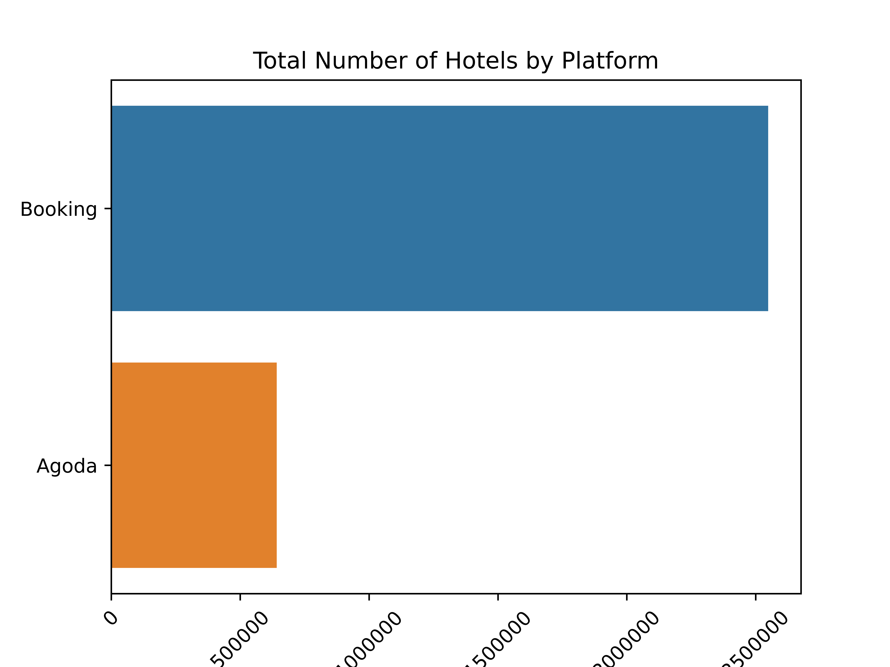
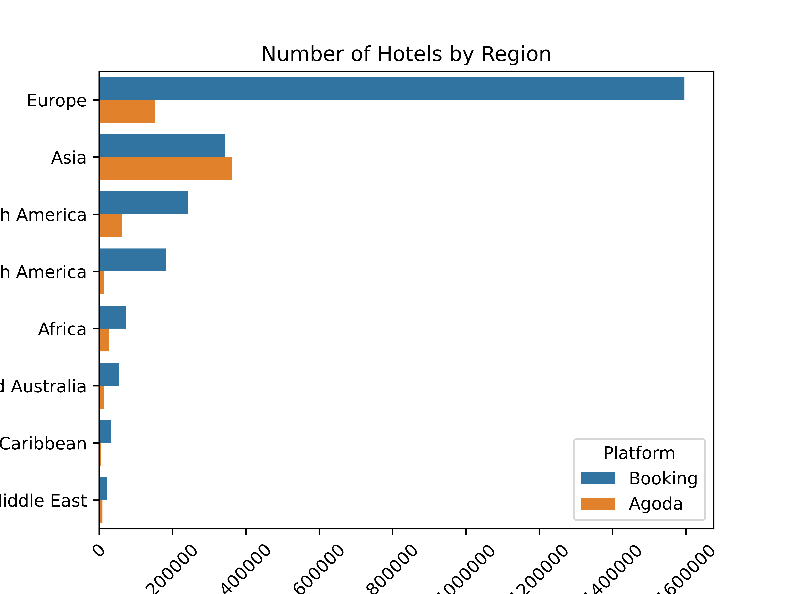
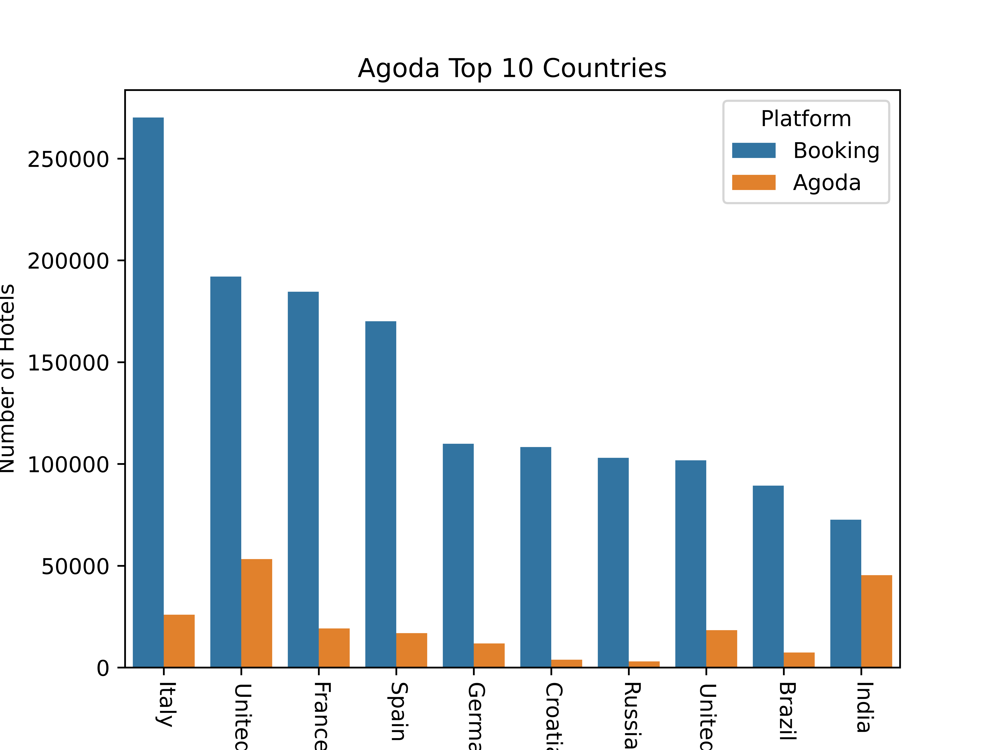
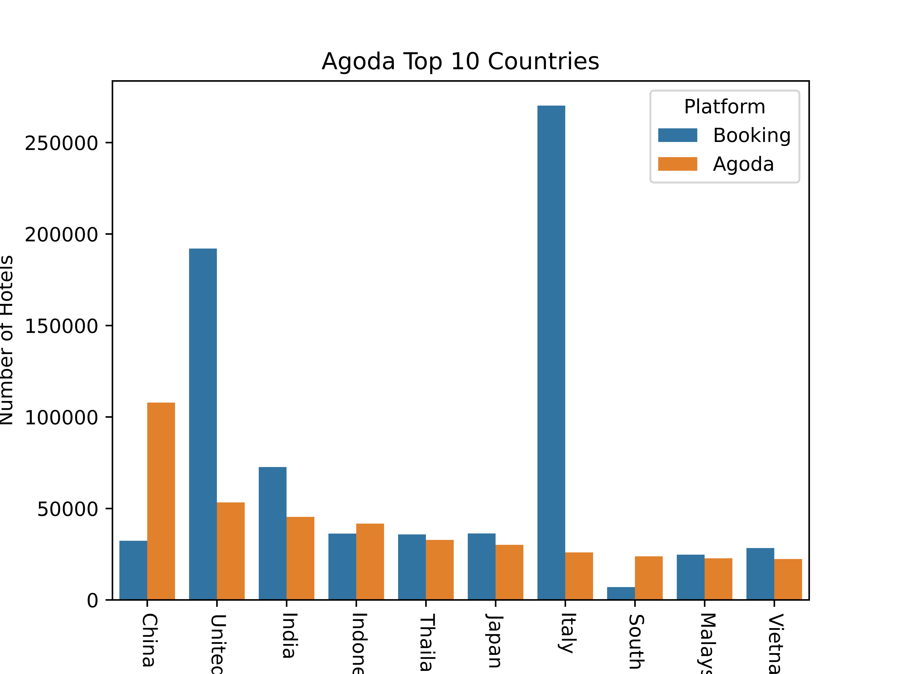

# Comparison of the hotel booking platforms Booking and Agoda

## Basic information:
- Author: Sergi Portolés
- Project II: Ironhack Data Analyst Bootcamp (pipelines)
- Results might be incorporated in the website [Sapore di Cina](https://www.saporedicina.com/english/)
## Sources:
| Source   |      Type      |  Data extracted  |
|----------|:-------------:|------:|
| [Agoda Partners Portal](https://partners.agoda.com/)|  CSV file1 | Information of all hotels offered in the portal |
| [Booking](https://www.booking.com/) | Web Scrapping | Number of hotels offered in a country, city or region |
|[Bing](https://www.bing.com/)|Web Scrapping|Seacrh for Booking URL for a certain city
| [Rest Countries](https://restcountries.com/) | API | ISO codes and names of the countries |
 
1 File not provided in the repo
 
## Python libraries used:
 
| Library   |      Use     |
|----------|:-------------:|
| Pandas | Data Frame manipulation |
| Seaborn | Visualization |
| Matplotlib | Visualization |
| Responses | HTTP Calls |
| Bs4 (BeautifulSoup) | HTML manipulation |
| Geopandas | Country map visualization |
|Unidecode | encode to UTF8 cities names|

## Background:
- Booking.com headquarters are located in Amsterdam, Netherlands.
- Agoda headquarters are located in Singapore
- Currently Agoda is a currently a subsidiary of Booking Holdings.
## Objective of the study
- Compare the hotel booking platforms [Booking](https://www.booking.com/) and [Agoda](https://www.agoda.com/)
 
## Limitations of the study
- The impossibility to access to the Booking.com official data (API or Database) have forced to use web scrapping, this method might under-represent the number of hotels and locations for this platform
- This is a quantitative (number of hotels) not qualitative (prices) due to the lack of easy access to Booking.com data.
- The number of hotels are not filtered by type of accomodation and include hotels, apartments, villas and other types, again accessing booking source data is needed to filter the type of accomodation 

## Results
### Total Number of Hotels Globally

### Total Number of Hotels by Region

### Top Countries in Booking with more Hotels

### Top Countries in Agoda with more Hotels

### Asia
#### Taiwan

#### Thailand

#### China

### Europe
#### Croatia

#### Spain

## Results:
- Booking has a more significant number of hotels listed globally
- Booking has more hotels listed in all regions except in Asia
- The region with most hotels listed in Booking is Europe where the headquarters are localized
- The region with more hotels listed in Agoda is Asia where the headquarters are localized
- Created an application to compare Agoda and Booking total number of hotels in any country by cities and plot the results geographically